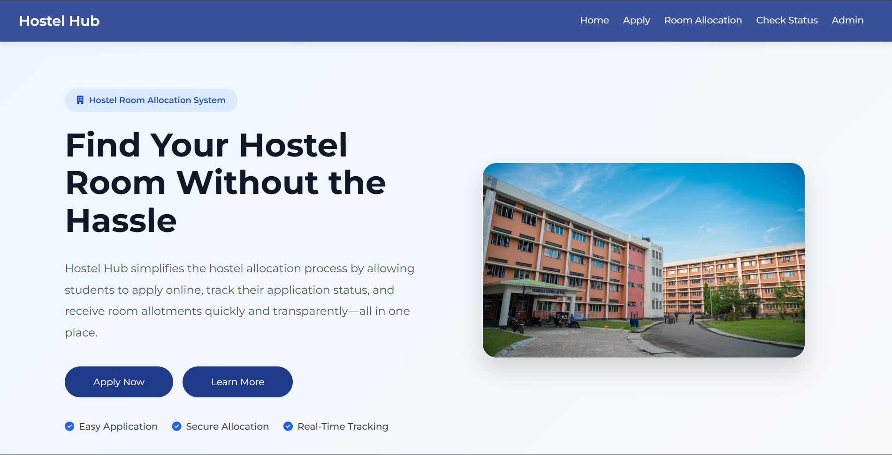

# Hostel Hub — Hostel Room Allocation System

A responsive frontend-based Hostel Room Allocation System built with HTML, CSS, and JavaScript. The system provides a complete workflow for hostel applications, admin approval, automated room allocation, roommate preferences, allocation status tracking, and room availability management.

## 🚀 Live Demo

[View Live Project](https://hostelhub-system.vercel.app/)

## 📸 Preview



## 📌 Overview

Hostel Hub is designed to simplify the hostel room allocation process for students and administrators.

Students can submit their hostel applications, specify hostel preferences and optionally request a roommate. Administrators can review applications, approve students, and run the room allocation process based on student eligibility, hostel preferences, room availability, and mutual roommate preferences.

The project is currently implemented as a frontend-only application using browser storage. A backend and database can be integrated in the future for persistent and secure multi-user data management.

## ✨ Features

### 👨‍🎓 Student Features

- Submit hostel applications
- Enter personal and academic information
- Select first and second hostel preferences
- Add an optional roommate preference
- Prevent duplicate applications using roll number validation
- Receive a unique Application ID after submission
- Check application status using the Application ID
- View allocated hostel, room, and bed details
- Responsive interface for desktop and mobile devices

### 🏠 Room Allocation

- Supports single and double occupancy rooms
- 4th-year students are assigned to single rooms
- 1st, 2nd, and 3rd-year students use double rooms
- Considers student hostel preferences
- Handles mutual roommate preferences
- Assigns available rooms and beds
- Falls back to the second hostel preference when required
- Marks applications as Unallocated when suitable space is unavailable
- Stores allocation information for later status checking

### 🛠️ Admin Features

- Admin login authentication
- View submitted applications
- Review student application details
- Approve applications
- Run automated room allocation
- View allocation status
- View hostel, room, and bed information
- Filter room allocation by hostel
- Load predefined demo data
- Reset demo application and allocation data
- Logout functionality

## 🔐 Admin Login

The current frontend demo uses a fixed admin account:

**Email:** `admin@hostelhub.com`  
**Password:** `admin123`

> **Note:** This authentication is implemented on the frontend using `sessionStorage` and is intended only for demonstration purposes. It is not suitable for production security.

## 🧠 Allocation Workflow

The allocation process follows this general workflow:

1. Student submits a hostel application.
2. Admin reviews the application.
3. Admin approves eligible applications.
4. The allocation engine processes approved applications.
5. Student hostel preferences are considered.
6. Mutual roommate preferences are matched.
7. Available rooms and beds are checked.
8. Students are assigned to suitable rooms.
9. Allocation details are stored with the application.
10. Students can view their allocation through the Check Status page.

## 💾 Data Storage

The current version uses browser storage:

- `localStorage` — stores applications and hostel/room allocation data.
- `sessionStorage` — maintains the admin login session.

This makes the project easy to run without a backend while demonstrating the complete application workflow.

## 🧰 Technologies Used

- HTML5
- CSS3
- JavaScript (ES6+)
- LocalStorage
- SessionStorage
- Font Awesome
- Google Fonts
- Vercel

## 📁 Project Structure

```text
hostel-room-allocation-system/
│
├── assets/
│   ├── hostel.jpg
│   └── images.jpg
│
├── css/
│   ├── admin.css
│   ├── admin-login.css
│   ├── apply.css
│   ├── check-status.css
│   ├── footer.css
│   ├── global.css
│   ├── nav.css
│   ├── room-allocation.css
│   ├── style.css
│   └── variable.css
│
├── html/
│   ├── admin.html
│   ├── admin-login.html
│   ├── apply.html
│   ├── check-status.html
│   ├── index.html
│   └── room-allocation.html
│
├── js/
│   ├── admin.js
│   ├── admin-login.js
│   ├── allocation-engine.js
│   ├── apply.js
│   ├── check-status.js
│   ├── demo-data.js
│   ├── hostel-data.js
│   ├── nav.js
│   └── room-allocation.js
│
├── .gitignore
├── LICENSE
├── README.md
└── vercel.json
```

## 📧 Contact

**Adarsh Seth**

- GitHub: https://github.com/adarsh-seth
- LinkedIn: https://www.linkedin.com/in/adarsh-seth/
- Email: adarshseth999@gmail.com